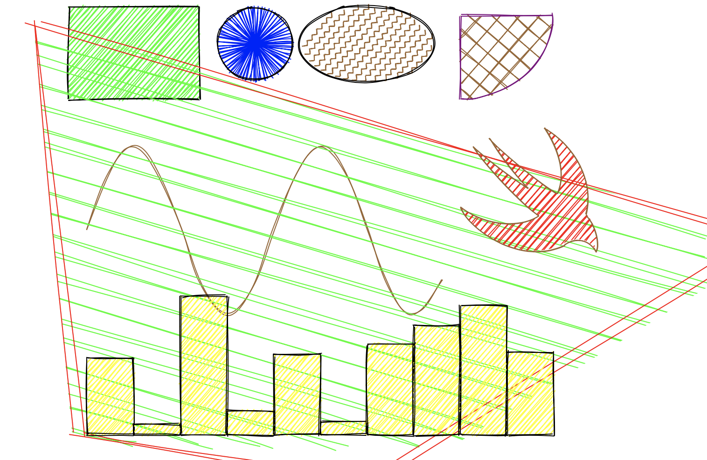
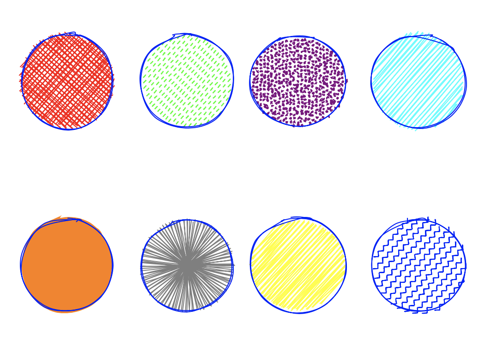
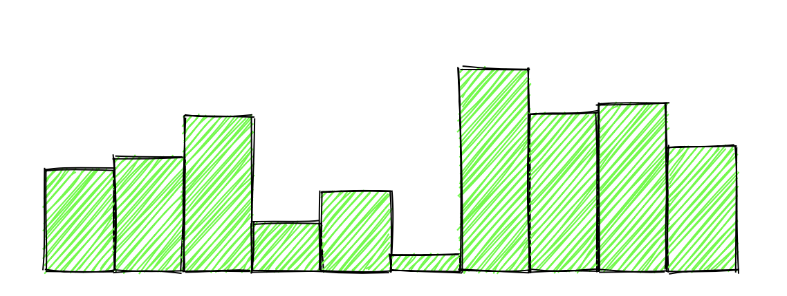

[](http://cocoadocs.org/docsets/RoughSwift)
[](https://github.com/Carthage/Carthage)
[](http://cocoadocs.org/docsets/RoughSwift)
[](http://cocoadocs.org/docsets/RoughSwift)




## Description

RoughSwift allows us to easily make shapes in hand drawn, sketchy, comic style. Based on the same concept of [Snowflake](https://github.com/onmyway133/Snowflake) which generates `CALayer` that are highly composable and changeable, RoughSwift turns drawing commands into beautiful sketchy graphics.

- [x] Support iOS, tvOS
- [ ] Support macOS
- [x] Support all shapes: line, rectangle, circle, ellipse, linear path, arc, curve, polygon, svg path
- [x] Generate `UIBezierPath` for `CAShapeLayer`
- [x] Easy cusomizations with Options
- [x] Easy composable APIs
- [x] Convenient draw functions
- [x] Platform independant APIs which can easily support new platforms
- [x] Test coverage
- [x] Immutable and type safe data structure
- [ ] SVG elliptical arc

There are [Playground](https://github.com/onmyway133/RoughSwift/tree/master/Playground-iOS.playground) and [Example](https://github.com/onmyway133/RoughSwift/tree/master/Example/RoughSwiftDemo) project where you can explore further.

## Basic

Use `generator` in `draw` function to specify which shape to render. The returned `CALayer` contains the rendered result in correct `size` and is updated everytime `generator` is instructed.

Here's how to draw a green rectangle


```swift
let size = Size(width: 300, height: 200)
let layer = draw(size: size, using: { generator in
  var options = Options()
  options.fill = UIColor.green
  generator.rectangle(x: 80, y: 10, width: 140, height: 100, options: options)
}
```

The beauty of `CALayer` is that we can further animate, transform (translate, scale, rotate) and compose them into more powerful shapes.

## Options

`Options` is used to custimize shape. It is immutable struct and apply to one shape at a time. The following properties are configurable

- maxRandomnessOffset
- toughness
- bowing
- fill
- stroke
- strokeWidth
- curveTightness
- curveStepCount
- fillStyle
- fillWeight
- hachureAngle
- hachureGap
- dashOffset
- dashGap
- zigzagOffset

## Shapes

RoughSwift supports all primitive shapes, including SVG path

- line
- rectangle
- ellipse
- circle
- linearPath
- arc
- curve
- polygon
- path

## Fill style

Most of the time, we use `fill` for solid fill color inside shape, `stroke` for shape border, and `fillStyle` for sketchy fill style.

Here's how to draw circles in different fill styles. The default fill style is hachure



```swift
let layer = draw(size: size, using: { generator in
  var options = Options()
  options.stroke = UIColor.blue
  
  options.fill = UIColor.red
  options.fillStyle = .crossHatch
  generator.circle(x: 100, y: 100, diameter: 100, options: options)
    
  options.fill = UIColor.green
  options.fillStyle = .dashed
  generator.circle(x: 230, y: 100, diameter: 100, options: options)
    
  options.fill = UIColor.purple
  options.fillStyle = .dots
  generator.circle(x: 350, y: 100, diameter: 100, options: options)
    
  options.fill = UIColor.cyan
  options.fillStyle = .hachure
  generator.circle(x: 480, y: 100,  diameter: 100, options: options)
  
  options.fill = UIColor.orange
  options.fillStyle = .solid
  generator.circle(x: 100, y: 300,  diameter: 100, options: options)
  
  options.fill = UIColor.gray
  options.fillStyle = .starBurst
  generator.circle(x: 230, y: 300, diameter: 100, options: options)
    
  options.fill = UIColor.yellow
  options.fillStyle = .zigzag
  generator.circle(x: 350, y: 300,  diameter: 100, options: options)
  
  options.fill = UIColor.blue
  options.fillStyle = .zigzagLine
  generator.circle(x: 480, y: 300, diameter: 100, options: options)
})
```

## SVG


SVG shape can be bigger or smaller than the specifed layer size, so RoughSwift scales them to your requested `size`. This way we can compose and transform the SVG shape.

```swift
let bird = draw(size: CGSize(width: 150, height: 150), using: { generator in
  var options = Options()
  options.stroke = UIColor.brown
  options.fill = UIColor.red
  let apple = "M85 32C115 68 239 170 281 192 311 126 274 43 244 0c97 58 146 167 121 254 28 28 40 89 29 108 -25-45-67-39-93-24C176 409 24 296 0 233c68 56 170 65 226 27C165 217 56 89 36 54c42 38 116 96 161 122C159 137 108 72 85 32z"
  generator.path(d: apple, options: options)
})

bird.frame.origin = CGPoint(x: 100, y: 100)
```

## Creative shapes

With all the primitive shapes, we can create more beautiful things. The only limit is your imagination.

Here's how to create chart



```swift
let width: Float = 50
var options = Options()
options.fill = UIColor.yellow
Array(0..<10).forEach { i in
  let height = Float(arc4random_uniform(150))
  generator.rectangle(x: Float(i) * width + 100, y: 470 - height, width: width, height: height, options: options)
}
```


## Advance with Drawable, Generator and Renderer

Behind the screen, `draw` function composes `Generator` and `Renderer`. We don't really need to know this detail but it's good to know in case we want more fine grained control. 

We can instantiate `Engine` or use a shared `Engine` for memory efficiency, to make `Generator`. Every time we instruct `Generator` to draw a shape, the engine works hard to figure out information about the sketchy shape in `Drawable`.

The name of these concepts follow `rough.js` for better code reasoning.

For iOS, there is a `Renderer` that can handle `Drawable` and transform it into `UIBezierPath` and `CALayer`. There will be more `Renderer` that can render into graphics context, image and for other platforms like macOS and watchOS.


```swift
let layer = CALayer()
  
let generator = Engine.shared.generator(size: size)
let renderer = Renderer(layer: layer)
generator.onDrawable = renderer.handle
```

## Installation

**RoughSwift** is available through [CocoaPods](http://cocoapods.org). To install
it, simply add the following line to your Podfile:

```ruby
pod 'RoughSwift'
```

**RoughSwift** is also available through [Carthage](https://github.com/Carthage/Carthage).
To install just write into your Cartfile:

```ruby
github "onmyway133/RoughSwift"
```

**RoughSwift** can also be installed manually. Just download and drop `Sources` folders in your project.

## Author

Khoa Pham, onmyway133@gmail.com

## Credit

- [rough](https://github.com/pshihn/rough) for the generator that powers RoughSwift. All the hard work is done via rough in JavascriptCore.
- [SVGPath](https://github.com/timrwood/SVGPath) for constructing UIBezierPath from SVG path

## Contributing

We would love you to contribute to **RoughSwift**, check the [CONTRIBUTING](https://github.com/onmyway133/RoughSwift/blob/master/CONTRIBUTING.md) file for more info.

## License

**RoughSwift** is available under the MIT license. See the [LICENSE](https://github.com/onmyway133/RoughSwift/blob/master/LICENSE.md) file for more info.
